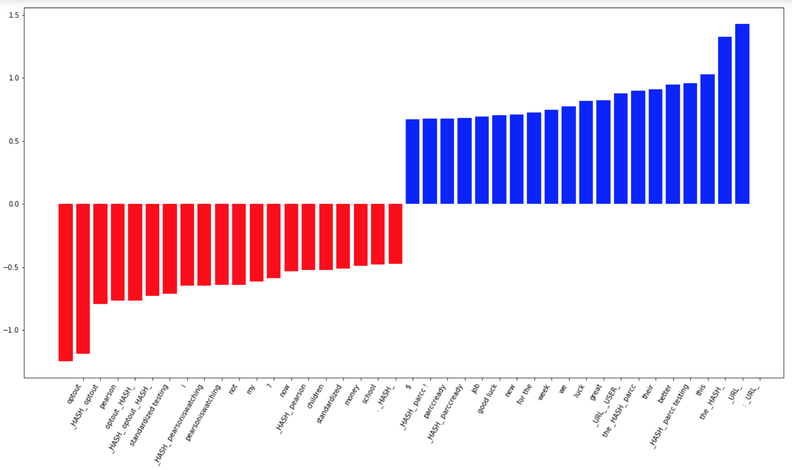

```{r setup, include=FALSE}
knitr::opts_chunk$set(echo = TRUE,out.width='750px', dpi=400)
```

## Content Drift: Testing whether the classifier remains valid over time. 

This memo describes the work done so far in addressing this comment from the editor: 

> But why claim the April sample is a validation sample? It is a different population of tweets, and the fact that the precision is so low, and so much lower than for the March validation samples, suggests that the content of tweets changed considerably in a month. You note this, but do not really engage with what this implies. What should we make of it? To my mind the April analysis is not a validation analysis but a measure of content drift. That suggests that it would be useful to look at whether the classifier works well over the long run -- you have data for 4 years, I believe, but never make use of it. In sum, I think it may make more sense to think of the April sample as useful not for validation of the classifier trained on March tweets, but rather to think of all the other months as useful for testing whether the classifier remains valid over time. 
 
Using the "not critical" model, I ran all tweets from all months in our five year sample through this model to automatically classify all tweets as such. As a reminder, the "not critical" model is the one trained on all 205 tweets that we later broke down into separate "encouraging" and "in favor of testing" models. That is, we chose the more general model for this analysis.

For each year, we have five months of tweets, which comprise the second part of each school year: January, February, March, April, and May. The workbook that contains the classified tweets for all months is located here: https://docs.google.com/spreadsheets/d/1HThyDkgCSiaoBoXqR7ktvbUPBOOhwhwat_89si5wipo/edit#gid=793494855

Although the "not critical" model classified these tweets as such, there is, of course, some noise -- that is, tweets that aren't actually "not critical" -- and we are interested in how these patterns in noise change over time. That is, we want to describe the composition of classified tweets for each month. We started this work in our original manuscript (though we called this a "validation sample"), noting that the number of tweets in April 2015 that were truly not critical was approximately 1/3 of all tweets classified as such. As a reminder, the initial training sample was developed by the four authors collectively reviewing 5,000 tweets in March 2015 to arrive at our training sample of 205 tweets (suggesting a rough estimate of 5% of tweets in March being "not critical"). And, while we did succeed in reducing the noise in finding "not critical" tweets in this smaller April 2015 sample, the precision is quite a bit lower than what we saw in the validation of our training sample. 

These April 2015 findings prompt further questions: <p>
1. How does the precision in April 2015 compare to April 2013, 2014, 2016 and 2017? That is, how does the composition of classified tweets change across years? <p>
2. How does the precision of April 2015 compare to February 2015 and March 2015? That is, how does the composition of classified tweets change within a single year? <p>

The details on this coding process are presented in the next section, but the first thing to do is to explore the proportion of tweets from each month that were classified as "not critical" by our model. In the graph below, we see that the proportion of tweets for a given month ranges from 9% to 23%. Given that we have a rough estimate that the "true" number of tweets that were not critical in nature was around 5% in March 2015, some of these months has a proportion of tweets quite a bit higher (though the absolute counts might still be a manageable size).

From an inspection of the graph below,the months with the lowest proportion of tweets being classified as "not critical" are April 2015 (with 1,227 tweets) and February (with 78 tweets). After February 2016, the proportion of classified tweets remains below 20%. 

Note that the training sample was created from March 2015 (at the height of the opt-out conversation), and 15% of the tweets were classified as "such."not critical." A closer look at the composition of these classified tweets will shed light on the how this model performs not only across other months and years, but how the model performed within the month and year in which the training sample was created (something that we didn't look at for the original manuscript).  
 
```{r cars, echo=FALSE, warning=FALSE}
# read in data for all months
library(ggplot2)
library(data.table)
library(WriteXLS)
library(openxlsx)
library(readr)
setwd("~/Dropbox/rTwitter/data/")
set.seed(42)
all_files <- list.files()

years <- c("2017", "2016", "2015", "2014", "2013")
months <- c("April", "February", "January", "March", "May")

# compute the total number of tweets
# compute the total number of tweets classified as Not Critical


saveinfo <- NA
for (year in years)
  {
    for (month in months)
      {
        setwd("~/Dropbox/rTwitter/data/")
        tmp <- paste0(year,"-",month,".txt")
        tot <- nrow(fread(tmp, sep = "\t"))
        setwd("~/Dropbox/rTwitter/input/")
        tmp_class <- paste0(tmp,"_SVC-iter3a_out_class1.txt")
        classified <- nrow(fread(tmp_class, sep = "\t"))
        prop <- classified/tot
        info <- cbind(year, month, prop, classified)
        saveinfo <- rbind(saveinfo, info)
        
      }

  }

saveinfo <- as.data.frame(saveinfo)
saveinfo <- subset(saveinfo, !is.na(saveinfo$year))
saveinfo$mth2 <- NA
saveinfo$mth2 <- ifelse(saveinfo$month == "January", "01", saveinfo$mth2)
saveinfo$mth2 <- ifelse(saveinfo$month == "February", "02", saveinfo$mth2)
saveinfo$mth2 <- ifelse(saveinfo$month == "March", "03", saveinfo$mth2)
saveinfo$mth2 <- ifelse(saveinfo$month == "April", "04", saveinfo$mth2)
saveinfo$mth2 <- ifelse(saveinfo$month == "May", "05", saveinfo$mth2)

saveinfo$date <- NA
saveinfo$date <- paste0(saveinfo$mth2,"/01/",substr(saveinfo$year,3,4))
saveinfo$date2 <- as.Date.character(saveinfo$date, "%m/%d/%y")
saveinfo$proportion <- as.numeric(as.character(saveinfo$prop))
row.names(saveinfo) <- NULL
saveinfo <- saveinfo[order(saveinfo$date2),]

saveinfo$datetext <- paste0(saveinfo$year,"-",saveinfo$month)
saveinfo$datetext <- reorder(saveinfo$datetext, as.numeric(rownames(saveinfo)))
rowreorder <- as.numeric(rownames(saveinfo))

classified <- saveinfo$classified
ggplot(aes(reorder(x=datetext,as.numeric(rownames(saveinfo))), y = saveinfo$proportion,group = 1, label=classified), data = saveinfo) + geom_line()+
ylab("Proportion")+
geom_text(aes(label=classified),hjust=0, vjust=0)+
xlab("Month of tweets")+ theme(axis.text.x = element_text(angle = 90, hjust = 1))+
scale_x_discrete(limits = saveinfo$datetext)+
  ggtitle("Proportion (and counts) of text classified as 'Not Critical'")


ggplot(aes(reorder(x=datetext,as.numeric(rownames(saveinfo))), y = saveinfo$proportion,group = 1, label=classified), data = saveinfo) + geom_line()+
ylab("Proportion")+
geom_text(aes(label=NA),hjust=0, vjust=0)+
xlab("Month of tweets")+ theme(axis.text.x = element_text(angle = 90, hjust = 1))+
scale_x_discrete(limits = saveinfo$datetext)+
  ggtitle("")
                 
```

## What is the composition of tweets classified by the "not critical" model in 2013, 2014, 2015, 2016, and 2017?
Although we might ultimately just compute a precision value (number of 'not critical tweets' divided by total number of tweets classified), for now we are taking a more detailed look at the composition of the tweets. We have started this work of examining how the model classifies tweets over time by looking at the months of April. For each tweet classified as 'not critical' we read each tweet, and assign one of the following codes: 

1. Critical  <p>
2. Encouraging <p>
3. Pro-testing <p>
4. Ambiguous <p>
5. Neutral. <p>

Note that the 'Neutral' code was included once we started examining the tweets from 2013 and 2014 and noted that the conversation wasn't nearly as polarized as it was in 2015, and that we were having a difficult time determining if a tweets was either critical or not-critical. We also included the 'Ambiguous' code to classify when we were unclear as to what the user was trying to convey (sometimes it included possible sarcasm that was difficult to decipher).

### Inter-rater agreement
In addition to reviewing all tweets classified as 'not critical' for all months of April, I also took a random 10% from each month and set them aside. Therefore, when co-author doesn't engage in the coding of tweets for a particular month, they can instead code the random sample so that we can compute inter-rater agreement rates. 

### Graphical Presentation
The chart below shows the total number of tweets classified for each year in April. Note that we have not coded April 2016 yet, and we need to re-code April 2015 to further elaborate on the composition (in our first manuscript we were only interested in computing precision). This work is very preliminary, and we need to review the codes further before a final presentation (as well as an improved visual presentation). Based on our initial findings, though, April 2017 had the most relevant tweets classified. If we count "Neutral" tweets as being "Not critical" then 2013 also had little noise. Interestingly, April 2015 (the month adjacent to the month of where the training data was selected) had the most noise in the classification. 

```{r pressure, echo=FALSE, warning=FALSE}
# read in the spreadsheet
# create plots of the total count, and then the number that are not critical
library(readxl)
library(ggplot2)
years <- c("2017", "2016", "2015", "2014", "2013")

months <- c("April")
setwd("~/Dropbox/rTwitter/")
tabs <- as.data.frame(c("All-Flagged","-","--","Ambiguous","Critical","Encouraging","Neutral","Pro-testing"), stringASFactors = FALSE)
colnames(tabs)[1] <- "code"
for (year in years)
{
  for (month in months)
  {
    tab <- paste0(year,"-",month)
    tmp <- read_excel("mock-up-all_months_scored.xlsx", sheet = tab)
    tmp <- subset(tmp, !is.na(tmp$`Not Critical?`))
    tmptab <- as.data.frame(table(tmp$`Not Critical?`))
    flagged <- as.data.frame(cbind("All-Flagged", nrow(tmp)), stringASFactors = FALSE)
    colnames(flagged) <- c("Var1", "Freq") 
    tmptab <- rbind(tmptab,flagged)
    colnames(tmptab) <- c("Var1", tab)
    tabs <- merge(x=tabs,y=tmptab, by.x ="code", by.y ="Var1", all.x=TRUE)

  }
  
  
}

positive <- subset(tabs, tabs$code == "Pro-testing" | tabs$code == "Encouraging")
positive <- as.numeric(positive[1,2:6]) + as.numeric(positive[2,2:6])
total <- subset(tabs, tabs$code == "All-Flagged" | tabs$code == "--")
tot2 <- as.numeric(total[2,2:6]) -as.numeric(total[1,2:6]) 
prop <- round(positive/tot2,2)
pos <- rep(tot2, each=5)
labels <- unlist(lapply(as.character(prop), function(x) c(rep("", 4), x)))
tabs$`2016-April` <- as.numeric(as.character(tabs$`2016-April`))
tabs[is.na(tabs)] <- 0
melted <- melt(tabs, "code")
melted$newcode <- NA
melted$newcode <- ifelse(melted$code == "Critical","a_Critical", melted$newcode)
melted$newcode <- ifelse(melted$code == "Pro-testing","e_Pro-testing", melted$newcode)
melted$newcode <- ifelse(melted$code == "Encouraging","d_Encouraging", melted$newcode)
melted$newcode <- ifelse(melted$code == "Ambiguous","b_Ambiguous", melted$newcode)
melted$newcode <- ifelse(melted$code == "Neutral","c_Neutral", melted$newcode)
melted$code <- NULL

melted$value <- as.numeric(melted$value)
melted <- subset(melted, melted$newcode == "a_Critical"| melted$newcode=="e_Pro-testing"| melted$newcode=="d_Encouraging"  | melted$newcode=="b_Ambiguous" 
                 | melted$newcode=="c_Neutral")


melted$date <- NA
melted$date <- paste0("04/01/",substr(melted$variable,3,4))
melted$dat2 <- as.Date.character(melted$date, "%m/%d/%y")


melted <- melted[order(melted$dat2),]
row.names(melted) <- NULL
melted$variable <- reorder(melted$variable, as.numeric(rownames(melted)))
rowreorder <- as.numeric(rownames(melted))


ggplot(melted, aes(x = (reorder(x=variable,as.numeric(rownames(melted)))), y = value, fill = newcode)) + 
  geom_bar(stat = 'identity', position = 'stack',  colour="black") + 
  theme_linedraw() +
  geom_text(aes(y=rev(pos),label=rev(labels)), vjust=0)+
  labs(x="", y="Coding of Tweets Automatically Classified as 'Not Critical'")+
  scale_fill_manual(name="", values=c("white","#D3D3D3","#A9A9A9", "#787878", "black"), 
                    breaks=c("a_Critical",
                             "b_Ambiguous",
                             "c_Neutral",
                             "d_Encouraging",
                             "e_Pro-testing"),
                    labels = c("Critical",
                               "Ambiguous", 
                               "Neutral",
                               "Encouraging", 
                               "Pro-testing")
                    ) 
```


## What is the composition of tweets classified by the "not critical" model in 2015?
(This work is underway.)
```{r pressure2, echo=FALSE, warning=FALSE}
# read in the spreadsheet
# create plots of the total count, and then the number that are not critical
library(readxl)
library(ggplot2)
library(data.table)
years <- c("2015")
months <- c("February", "March", "April")

setwd("~/Dropbox/rTwitter/")
tabs <- as.data.frame(c("All-Flagged","-","--","Ambiguous","Critical","Encouraging","Neutral","Pro-testing"), stringASFactors = FALSE)
colnames(tabs)[1] <- "code"
for (year in years)
{
  for (month in months)
  {
    tab <- paste0(year,"-",month)
    tmp <- read_excel("mock-up-all_months_scored.xlsx", sheet = tab)
    tmp <- subset(tmp, !is.na(tmp$`Not Critical?`))
    if (month == "March")
      
    {
      tmp <- subset(tmp, is.na(tmp$`In Training Sample`)) # remove responses that were used in the training data
    }
    
    tmptab <- as.data.frame(table(tmp$`Not Critical?`))
    flagged <- as.data.frame(cbind("All-Flagged", nrow(tmp)), stringASFactors = FALSE)
    colnames(flagged) <- c("Var1", "Freq") 

    

     # Make sure to remove responses that were flagged 
     tmptab <- rbind(tmptab,flagged)
     colnames(tmptab) <- c("Var1", tab)
     tabs <- merge(x=tabs,y=tmptab, by.x ="code", by.y ="Var1", all.x=TRUE)

  }
}

positive <- subset(tabs, tabs$code == "Pro-testing" | tabs$code == "Encouraging")
positive <- as.numeric(positive[1,2:4]) + as.numeric(positive[2,2:4])
total <- subset(tabs, tabs$code == "All-Flagged" | tabs$code == "--")
tot2 <- as.numeric(total[2,2:4]) -as.numeric(total[1,2:4]) 
prop <- round(positive/tot2,2)
pos <- rep(tot2, each=5)


labels <- unlist(lapply(as.character(prop), function(x) c(rep("", 4), x)))


tabs[is.na(tabs)] <- 0
melted <- melt(tabs, "code")
melted$value <- as.numeric(melted$value)
melted <- subset(melted, melted$code == "Critical"| melted$code=="Pro-testing"| melted$code=="Encouraging"  | melted$code=="Ambiguous" 
                 | melted$code=="Neutral")
melted$newcode <- NA
melted$newcode <- ifelse(melted$code == "Critical","a_Critical", melted$newcode)
melted$newcode <- ifelse(melted$code == "Pro-testing","e_Pro-testing", melted$newcode)
melted$newcode <- ifelse(melted$code == "Encouraging","d_Encouraging", melted$newcode)
melted$newcode <- ifelse(melted$code == "Ambiguous","b_Ambiguous", melted$newcode)
melted$newcode <- ifelse(melted$code == "Neutral","c_Neutral", melted$newcode)
melted$code <- NULL

melted$date <- NA
melted$date <- paste0("04/01/",substr(melted$variable,3,4))
melted$dat2 <- as.Date.character(melted$date, "%m/%d/%y")


melted <- melted[order(melted$dat2),]
row.names(melted) <- NULL
melted$variable <- reorder(melted$variable, as.numeric(rownames(melted)))
rowreorder <- as.numeric(rownames(melted))


ggplot(melted, aes(x = (reorder(x=variable,as.numeric(rownames(melted)))), y = value, fill = newcode)) + 
  geom_bar(stat = 'identity', position = 'stack',  colour="black") + 
  theme_linedraw() +
   geom_text(aes(y=pos,label=labels), vjust=0)+
  labs(x="", y="Coding of Tweets Automatically Classified as 'Not Critical'")+
  scale_fill_manual(name="", values=c("white","#D3D3D3","#A9A9A9", "#787878", "black"), 
                    breaks=c("a_Critical",
                             "b_Ambiguous",
                             "c_Neutral",
                             "d_Encouraging",
                             "e_Pro-testing"),
                    labels = c("Critical",
                               "Ambiguous", 
                               "Neutral",
                               "Encouraging", 
                               "Pro-testing")
                    ) 

```

## Some Qualitative Observations 
Below are some observations about how the content of the classified tweets has changed over time. 

### 2013
+ Politics about the consortia 
+ Item development of the PARCC and SBAC
+ Technology development for hosting sites
+ A lot neutral tweets, including questions rather than arguments.  

### 2014 
+ Technology development (e.g., ACER laptops implementation)
+ Questions about the development and implementation of parcc
+ Confusion around whether or not you can opt out
+ Tone of opting out is less polarizing: “Today was the first day of many for opting out of the tests. We hope it has gone well for those opting out and those who have taken the test”
+ General tone of tweets -- both critical and not critical don't’ seem as polarizing. 
+ Learning about how smarter balanced test "works""
+ Learning how to opt out

### 2017
+ A shift in the conversation: Almost all tweets were classified not only as 'not critical' but "encouraging," where teachers are encouraging students to take the test. 

## An note on some of the features contributing to a tweet's classification 
To remove some of the "black box" nature of machine learning and understanding how the classifier "makes decisions," I have done a little bit of work to see which words (or sequences of words) are important contributors to the classification. For this work, I have relied on a blog post to figure out how to extract the important words and phrases (you might have to zoom in): 

> Recall that a linear SVM creates a hyperplane that uses support vectors to maximise the distance between the two classes. The weights obtained from svm.coef_ represent the vector coordinates which are orthogonal to the hyperplane and their direction indicates the predicted class. The absolute size of the coefficients in relation to each other can then be used to determine feature importance for the data separation task.

https://medium.com/@aneesha/visualizing-top-features-in-linear-svm-with-scikit-learn-and-matplotlib-3454ab18a14d


I don't know how useful this is, but we do see that the following words are used to determine if a tweet is 'not critical' or not. 

Some important words associated with the "negative" class: 

- optout
- #optout
- I
- Pearson
- School
- Money 
- Standardized Test 

Some important words associated with the "positive" class: 

- We
- good luck
- great
- PARCC